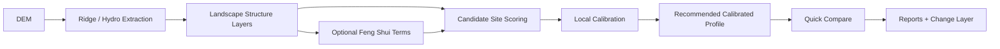

# Asian Landscape Reader (Feng Shui GIS)

> A QGIS plugin for DEM-first landscape reading, historical spatial interpretation, and evidence-aware Feng Shui analysis across East Asian and premodern contexts.

  

## Why this plugin exists

This project starts from a simple premise:

Landscape interpretation should begin with terrain and water structure, then add historically informed reading only where the evidence supports it.

That means the plugin is designed to help researchers:

- extract ridge and hydro structure from DEMs
- interpret terrain through optional Feng Shui term geometry
- score candidate sites with transparent reasons
- compare context-specific profiles instead of hiding assumptions
- keep research settings inspectable, calibratable, and reportable

It is especially aimed at people working on:

- East Asian landscape history
- settlement and mortuary geography
- geomantic interpretation as a research workflow
- reproducible spatial humanities and archaeological screening

## At a glance

| Area | What the plugin does |
|---|---|
| Terrain reading | Extracts ridge hierarchy from DEMs and builds hydro structure from provided water layers or DEM-derived flow paths |
| Feng Shui interpretation | Generates optional term points and structural links for terrain-based reading |
| Site evaluation | Scores candidate point layers with `fs_score`, explanation fields, and profile-aware reasoning |
| Context awareness | Supports neutral/general mode or advanced culture/period-aware interpretation |
| Calibration | Tunes local thresholds, indicator weights, and profile parameters from positive/negative site samples |
| Comparison | Compares base vs calibrated profiles and highlights where scores changed most |
| Documentation | Writes JSON and Markdown reports for calibration and profile comparison |
| Transparency | Surfaces context evidence, references, parameter notes, and profile provenance in the UI |

## Visual workflow

## Core capabilities

### 1. DEM-first landscape extraction

- Ridge hierarchy extraction (`daegan`, `jeongmaek`, `gimaek`, `jimaek`)
- Hydro network support from:
  - supplied vector water layers
  - DEM-derived fallback hydro when no curated layer exists
- Terrain-first workflow for historical landscape reading before interpretation layers are added

### 2. Optional Feng Shui term geometry

- Generates term points such as terrain-structure anchors
- Builds structural links between interpreted term locations
- Keeps term extraction optional so users can stay in pure landscape mode when needed

### 3. Candidate-site scoring

- Scores point layers with `fs_score`
- Writes reason fields such as `fs_reason` and language-aware explanations
- Supports profile-based reading for different use cases rather than one fixed rule set

### 4. Context-aware analysis

- General-principles mode for broadly shared terrain logic
- Advanced context mode for culture/period-sensitive interpretation
- Context evidence browser with source attribution and evidence-level notes
- Config-driven profiles and contexts instead of hardcoding assumptions directly in the UI

### 5. Local calibration

The calibration workflow is now more than threshold reporting.

It can:

- evaluate local positive and negative site samples
- tune local score thresholds
- reweight indicators when local data supports it
- adjust profile parameters such as slope/TPI targets and spreads
- export calibrated local profiles for reuse

Calibration outputs include:

- `cal_score`
- `cal_f1_th`
- `cal_yj_th`
- `cal_f1_ok`
- `cal_yj_ok`

### 6. Profile recommendation and quick comparison

After calibration, the plugin can:

- save calibrated local profiles
- reload them into the profile catalog
- recommend the most relevant calibrated profile for the current context
- switch to the recommended profile directly from the UI
- run a quick compare between base and calibrated profiles

Quick compare also adds:

- top changed feature summaries
- automatic feature selection
- automatic zoom to changed locations
- a dedicated change layer
- color-coded gain/drop/neutral symbology
- base vs calibrated reason comparison fields

### 7. Research reporting

The plugin writes machine-readable and human-readable reports to `reports/`.

Current report types include:

- calibration reports (`.json` + `.md`)
- profile comparison reports (`.json` + `.md`)

These reports can include:

- score performance summaries
- threshold summaries
- weight and parameter changes
- calibrated profile export metadata
- site-group / country / period mix when such fields exist
- cumulative calibration history summaries

## Main outputs

| Layer | Description |
|---|---|
| `*_fengshui_ridges` | Ridge hierarchy extracted from the DEM |
| `*_fengshui_hydro` | Provided hydro layer or DEM-derived hydro structure |
| `*_fengshui_terms` | Optional Feng Shui term points |
| `*_fengshui_links` | Optional structural links between interpreted terms |
| `*_fengshui` | Scored site layer with `fs_score` and explanation fields |
| compare change layer | Top changed features between base and calibrated profiles |

## Language and interface support

The plugin now supports explicit language switching.

- `UI Language`: controls buttons, help text, warnings, and interface labels
- `Label Language`: controls output-facing labels and report-facing text

This means you can, for example:

- use the interface in English
- keep output labels in Korean
- switch between `ko` and `en` without depending only on system locale

The plugin also supports preferred language selection for mountain-name enrichment (`local`, `ko`, `en`).

## Suggested workflow

### Basic terrain reading

1. Load a DEM in a projected CRS.
2. Add a curated water layer if available.
3. Run landscape extraction.
4. Inspect ridges and hydro before enabling interpretive layers.

### Historical / geomantic interpretation

1. Enable term extraction when terrain structure needs interpretive annotation.
2. Select a goal and profile appropriate to the research question.
3. Use advanced context mode only when culture/period overrides are justified.
4. Review context evidence before treating profile differences as meaningful.

### Local validation and tuning

1. Provide positive and negative site layers.
2. Run local calibration.
3. Inspect the report and saved calibrated profile.
4. Reload profiles and apply the recommended calibrated profile.
5. Run quick compare to inspect what changed spatially.

## Configuration-driven design

Most research assumptions live in configuration files rather than scattered code.

Important files:

- `feng_shui_gis/config/contexts.json`
- `feng_shui_gis/config/profiles.json`
- `feng_shui_gis/config/local_profiles.json`
- `feng_shui_gis/config/terms.json`
- `feng_shui_gis/config/analysis_rules.json`
- `feng_shui_gis/config/references.json`
- `feng_shui_gis/config/ui_texts.json`

This makes the plugin easier to:

- audit
- translate
- compare across case studies
- recalibrate for local datasets

## Evidence and reference support

The interface surfaces evidence rather than hiding it.

You can inspect:

- context references
- evidence levels
- parameter notes
- paper and catalog links

The repository also includes support for non-DOI reference records, including classical and interpretive sources that are useful for contextual reading but should not automatically be treated as validated spatial parameters.

Relevant reading in this repository:

- [docs/context_profiles.md](docs/context_profiles.md)
- [docs/regional_period_notes.md](docs/regional_period_notes.md)
- [docs/validation_protocol.md](docs/validation_protocol.md)
- [docs/reference_audit.md](docs/reference_audit.md)
- [docs/research_matrix.md](docs/research_matrix.md)
- [docs/researcher_quickstart.md](docs/researcher_quickstart.md)

## Requirements

- QGIS `3.28+`
- A projected CRS in meters is strongly recommended
- DEM quality strongly affects ridge, hydro, term, and scoring outputs

## Important research limits

This plugin is strongest where terrain structure is strongest.

More specifically:

- DEM / ridge / hydro extraction is the most reproducible part of the workflow
- profile differences across country and period should be treated as research assumptions until locally validated
- premodern texts such as `임원경제지` are valuable interpretation sources, but not all of their claims are ready to be used as numeric spatial parameters
- calibration helps align the workflow to a local sample, but it does not replace field verification or archaeological judgment
- automated outputs should not be presented as final conclusions on their own

## Repository support for reproducibility

This repository also contains reproducibility helpers:

- `examples/reproducibility_manifest.template.json`
- `tools/build_repro_manifest.py`
- `tests/test_reproducibility_contract.py`

For research-facing use, treat these as part of the project's audit trail rather than as optional extras.

## In one sentence

Asian Landscape Reader is a terrain-first, evidence-aware QGIS plugin for people who want to study historical landscape structure and Feng Shui interpretation without hiding the assumptions behind the analysis.
