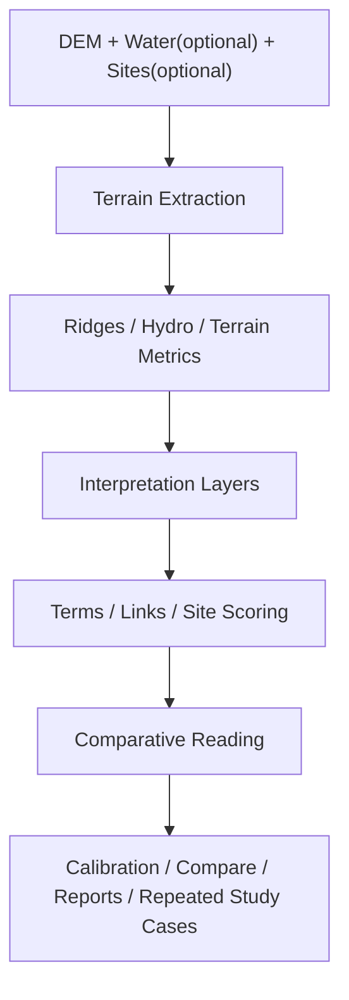

# 🧭 Feng Shui GIS

> **DEM-first QGIS plugin for terrain reading, principle-first Feng Shui interpretation, and comparative historical landscape analysis.**

풍수를 "자동 정답기"로 만들기보다,  
`지형 구조 추출 -> 원리 기반 해석 -> 비교/보정 -> 반복 가능한 실험`의 흐름으로 다루기 위한 GIS 플러그인입니다.


---

## ✨ At a Glance

| Lens | What it means here |
| --- | --- |
| 🏔️ Terrain-first | Start from DEM, ridges, hydro, slope, TPI, convergence |
| 📜 Principle-first | Explain sites with `배산/형국`, `혈 조건`, `사신사`, `장풍/감쌈`, `득수/수계 관계` first |
| 🫀 Visual-first | Show ridges and water as layered ribbons, not thin abstract wires |
| 🔁 Comparative | Use calibration and context/profile comparison to read differences, not to declare absolute truth |

> [!IMPORTANT]
> 이 플러그인은 **predictive truth model**이 아닙니다.  
> 점수는 발굴 진실을 대신하지 않고, 풍수적 공간 구조를 더 투명하고 반복 가능하게 읽도록 돕는 해석 보조 도구입니다.

---

## 🚪 Start Here

| Need | Go |
| --- | --- |
| ⚡ 빠르게 첫 실행 | [docs/first_run_guide.md](docs/first_run_guide.md) |
| 🧪 샘플/기준선 확인 | [examples/sample_project/README.md](examples/sample_project/README.md) |
| 📐 원리 우선 해석 모델 | [docs/PRINCIPLES.md](docs/PRINCIPLES.md) |
| 🎨 시각화 방향 | [docs/VISUALIZATION.md](docs/VISUALIZATION.md) |
| 🔬 연구용 워크플로 | [docs/researcher_quickstart.md](docs/researcher_quickstart.md) |
| ✅ 검증/제한사항 | [docs/validation_protocol.md](docs/validation_protocol.md), [docs/tested_versions.md](docs/tested_versions.md) |

---

## 🧠 What Makes This Plugin Different

### 🏔️ 1. Terrain structure comes first

- DEM에서 능선 구조를 뽑고
- water 레이어가 있으면 우선 사용하고, 없으면 DEM 기반 auto-hydro를 만들고
- slope / TPI / convergence 같은 지표를 해석의 기반으로 씁니다

즉, "문헌 이름표"부터 붙이는 게 아니라 **지형의 몸체를 먼저 읽습니다.**

### 📜 2. It is principle-first, not preset-first

후보지 설명은 이제 "이 프로파일은 tomb다"가 아니라 이런 원리에서 출발합니다.

- `배산/형국`
- `혈 조건`
- `사신사`
- `장풍/감쌈`
- `득수/수계 관계`

프로파일과 문화권/시대 컨텍스트는 여전히 중요하지만,  
**첫 해석층이 아니라 보정층**으로 다룹니다.

### 🫀 3. It wants to feel like a living terrain body

풍수는 점 몇 개와 가는 선 몇 개로 끝나지 않습니다.

현재 시각화 방향:

- ridges as `spine / vein ribbons`
- hydro as `flow ribbons`
- term points as `halo + body + core`
- structural links as `secondary anatomy`, not flat wiring

자세한 방향은 [docs/VISUALIZATION.md](docs/VISUALIZATION.md)에서 볼 수 있습니다.

### 🔁 4. It is made for comparison, not overclaiming

- local calibration으로 분리력을 점검하고
- profile/context compare로 상대 변화를 보고
- study-case 구조로 반복 실험을 굴립니다

즉, **"맞다/틀리다"보다 "어떻게 다르게 읽히는가"**에 초점을 둡니다.

---

## 🗺️ Workflow



---

## 🌟 Current Real Features

### 🏞️ Terrain extraction

- DEM 기반 ridge hierarchy 추출
- supplied water 우선 사용
- water가 없으면 auto-hydro 사용
- terrain metrics 계산

### 🧭 Interpretation layers

- Feng Shui term points 추출
- structural links 생성
- `fs_score`, `fs_note`, `fs_reason` 기반 site scoring
- sites 레이어는 `Point`뿐 아니라 `Polygon`도 입력 가능

### 🎛️ Conservative UI defaults

- front-door 목적 선택을 더 보수적으로 축소
- stable / exploratory preset 분리
- 과장된 preset 노출을 기본값에서 줄임

### 🧪 Repeated experiment loop

- local calibration
- threshold inspection fields
- repeated study-case bootstrap:
  `python3 tools/setup_study_case.py ...`

### 🎨 Visualization upgrade

- ridge / hydro / term / link 심볼을 다층 리본/핵 구조로 재정의
- 혈을 점핀으로만 두지 않고 `혈장 polygon`으로 함께 보여줌
- 사신사와 장풍을 구조선보다 먼저 읽히는 `반투명 감쌈장(field)`으로 겹쳐 표현
- GitHub README용 문서와 QGIS 도움말 텍스트도 같이 정리

---

## ⚡ Quick Start

### 1-minute path

1. QGIS에서 DEM을 고릅니다.
2. water 레이어가 있으면 넣고, 없으면 `auto-hydro`를 둡니다.
3. 점수화가 필요하면 sites 레이어를 넣습니다.
4. terrain extraction을 먼저 실행합니다.
5. 구조 읽기가 더 필요할 때만 term extraction을 켭니다.
6. terrain 결과가 납득될 때 site analysis로 넘어갑니다.

### 🔁 Repeated real-data workflow

실데이터를 여러 번 돌릴 예정이면 케이스 폴더를 먼저 만드는 편이 좋습니다.

```bash
python3 tools/setup_study_case.py \
  user_cases/gongju_baekje \
  --dem /path/to/666.tif \
  --sites /path/to/tomb_sites.shp \
  --water /path/to/water.shp \
  --title "Gongju Baekje study" \
  --profile tomb
```

이 명령은 다음을 만듭니다.

- `case.json`
- `README.md`
- `inputs/`

그리고 폴리곤 sites를 넣으면 centroid 기반 해석 경고도 함께 남깁니다.

---

## 📦 Main Outputs

| Layer | Meaning |
| --- | --- |
| `*_fengshui_ridges` | DEM-derived ridge hierarchy |
| `*_fengshui_hydro` | supplied or DEM-derived hydro network |
| `*_fengshui_terms` | Feng Shui term points |
| `*_fengshui_links` | structural links between terms |
| `*_fengshui` | site scoring layer with reasoning fields |

핵심 site fields:

- `fs_score`
- `fs_note`
- `fs_reason`
- `fs_sashinsa`
- `fs_enclosure`

---

## 🧪 What To Trust, What To Be Careful About

| ✅ Relatively strong | ⚠️ Needs caution |
| --- | --- |
| DEM handling | cultural translation |
| ridge extraction | profile/context generalization |
| hydro extraction | archaeology claims from score alone |
| explicit metric calculation | reading calibration as proof |

> [!NOTE]
> `fs_score`는 **site existence probability**가 아닙니다.  
> context/profile preset도 **보편 진실**이 아닙니다.

> [!TIP]
> 가장 좋은 사용법은 이렇습니다:  
> `terrain structure 확인 -> principle reading 확인 -> calibration/compare로 차이 확인 -> 현장 맥락과 함께 해석`

---

## 📚 Documentation Map

### Getting started

- [docs/first_run_guide.md](docs/first_run_guide.md)
- [examples/sample_project/README.md](examples/sample_project/README.md)
- [docs/troubleshooting.md](docs/troubleshooting.md)

### Interpretation model

- [docs/PRINCIPLES.md](docs/PRINCIPLES.md)
- [docs/VISUALIZATION.md](docs/VISUALIZATION.md)
- [docs/context_profiles.md](docs/context_profiles.md)

### Validation and evidence

- [docs/validation_protocol.md](docs/validation_protocol.md)
- [docs/validation_matrix.md](docs/validation_matrix.md)
- [docs/research_matrix.md](docs/research_matrix.md)
- [docs/reference_audit.md](docs/reference_audit.md)
- [docs/regional_period_notes.md](docs/regional_period_notes.md)

### Operations and reporting

- [docs/support_bundle_guide.md](docs/support_bundle_guide.md)
- [docs/release_checklist.md](docs/release_checklist.md)
- [docs/operations_playbook.md](docs/operations_playbook.md)

---

## 🧰 Requirements

- QGIS `3.28+`
- Python `3.8+`
- projected CRS in meters strongly recommended
- hydro-sensitive work에는 벡터 water layer 권장

---

## 🔗 Repository

- GitHub: [lzpxilfe/Feng-Shui-GIS](https://github.com/lzpxilfe/Feng-Shui-GIS)
