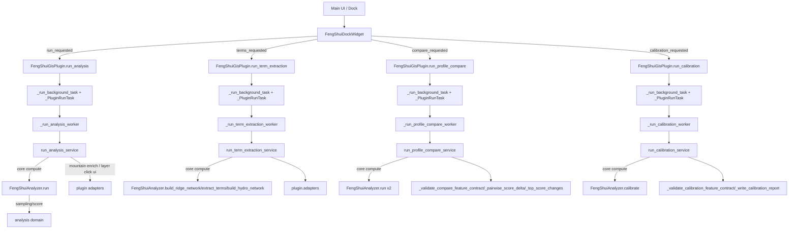

# Feng-Shui GIS 리팩터링 v1 Step 2: 호출 그래프 + 서비스 경계 설계안

작성일: 2026-04-01  
범위: `feng_shui_gis/plugin.py`, `feng_shui_gis/dock_widget.py`, `feng_shui_gis/application_services.py`, `feng_shui_gis/analysis.py`

이 단계의 목적은 기능 변경 없이 **실행 체인(누가 누구를 호출하는지)** 을 정리해 다음 단계에서 책임 분해를 안정적으로 진행할 수 있게 하는 것입니다.

## 2) 현재 호출 그래프(1차 정합)

## 2.1 책임 과부하 요약(현재)

- `dock_widget.py`
  - UI 구성·렌더링, 상태 표시, 시그널 발행을 수행
  - 일부 정책성 문구 계산(권장/비교 힌트)는 `dock_widget_viewmodel.py`로 분리되어 있어 과부하가 약화됨
- `plugin.py`
  - 진입점, 유효성 검사, 작업 큐, 경고/메시지, 레이어 이름·삽입·스타일·리포트 문자열 조립, 비교/캘리브레이션 후처리를 모두 수행
- `application_services.py`
  - 현재 네 개 워크플로우 서비스 경계 존재:
    - `run_analysis_service`
    - `run_term_extraction_service`
    - `run_profile_compare_service`
    - `run_calibration_service`
- `analysis.py`
  - 핵심 계산/규칙/보정은 `FengShuiAnalyzer`가 소유
  - 일부 레이어 보조 생성/포맷 작업이 함께 존재해 domain/adapters 분리가 필요

## 2.2 service boundary 설계안(현재 코드 기준)

### 공통 계약
- `service_contracts.py`를 기준 계약으로 사용
  - `AnalysisRequest`, `TermExtractionRequest`, `CompareRequest`, `CalibrationRequest`
  - `RunManifest` 생성: 입력 sha/config, seed, qgis 버전, layer metadata 포함
- 모든 service에서 실패 시:
  - `ok=False`
  - `error_code`, `error_context`, `error` 필드 형태로 반환

### `run_analysis_service`
- 역할: 분석 파이프라인 실행 진입점
- 입력: `AnalysisRequest`
- 처리:
  - DEM/points 산출 및 `FengShuiAnalyzer.run`
  - auto_hydro 생성 옵션 + 산명 보강 옵션 반영
  - 분석 레이어에 `feature_uid` 부여/클릭 바인딩
- 산출: 분석 레이어명, 산명 반영 수, manifest

### `run_term_extraction_service`
- 역할: 지형 추출/용어 추출 진입점
- 입력: `TermExtractionRequest`
- 처리:
  - 릿지/수계/용어/링크 레이어 생성
  - 산명 보강 후 반환 레이어 목록 반환
- 산출: 생성 레이어 목록(`created_layers`), 산명 반영 수, manifest

### `run_profile_compare_service`
- 역할: 기본/비교 프로파일 비교 진입점
- 입력: `CompareRequest`
- 처리:
  - 동일 컨텍스트 기준으로 base/compare 각각 `FengShuiAnalyzer.run`
  - UID 매칭 기반 통계/변화행 정리
- 산출: `top_changes`, `selected_change_count`, zoom/리포트 경로, manifest

### `run_calibration_service`
- 역할: 지역 보정 진입점
- 입력: `CalibrationRequest`
- 처리:
  - `FengShuiAnalyzer.calibrate`
- 산출: calibrated layer payload, calibration report, manifest

## 2.3 adapters 분해(제안)

- `qgis_layer_io`
  - `_output_layer_name`, `_copy_vector_layer`, `_insert_output_layers`, `_ensure_feature_uid_field`, 레이어 add/remove
- `qgis_rendering`
  - `_configure_layer_click_info`, `_set_field_aliases`, 스타일 유틸
- `qgis_dialogs`
  - `_write_profile_compare_report`, `_write_calibration_report`, 팝업/브라우저 표시
- `reporting`
  - 비교/캘리브레이션/용어 보고서 구성 본문(현재 plugin에 집중됨) 분리 대상
- `feature_identity`
  - `feature_uid`, `feature_uid_index`, 중복/누락 검증 헬퍼 일원화

## 2.4 기존 책임 매핑(현재→목표)

| 기존 위치 | 대상 메서드/기능 | 다음 단계 이동 방향 |
| --- | --- | --- |
| `dock_widget.py` | UI 구성, 레이어 선택/모드 표시, 시그널 emit | 유지: 렌더링 + 상태 바인딩만 |
| `dock_widget_viewmodel.py` | recommendation_state 계산 | 유지/확장: policy helper로 분리 강화 |
| `plugin.py` | run_* 슬롯, `_run_*_worker`, 백그라운드 태스크 관리 | run_*는 adapter만 남기고 worker의 계산/비즈니스는 서비스로 고정 |
| `plugin.py` | `_pairwise_score_delta`, `_top_score_changes`, `_select_top_changed_features`, `_zoom_to_selected_features` | `compare_reporting` 또는 `compare_domain`로 분리 검토 |
| `plugin.py` | `_validate_compare_feature_contract`, `_validate_calibration_feature_contract` | 계약 계층으로 고정, 오류 메시지 표준화 |
| `plugin.py` | `_write_profile_compare_report`, `_write_calibration_report` | `reporting` 계층 후보 |
| `analysis.py` | `run`, `calibrate`, score rule, metric helper | domain 중심으로 유지 |

## 2.5 Step 2 완료 기준

- [x] Step 2 문서가 현재 코드의 호출체인을 반영하도록 갱신됨
- [x] application service 이름/위치가 실제 모듈과 일치하도록 정합됨
- [x] feature identity 정책(`feature_uid`)을 호출/계약 경로 중심에 반영함
- [x] 다음 단계(계약 강화/캘리브레이션 분리/에러 카탈로그 정비)로 연결되는 작업 항목이 명시됨

## 2.6 다음 단계(즉시 착수)

1. `plugin.py`를 진입/시그널/작업관리 + 메시지 라우팅으로 더 축소
2. compare/calibration contract fail-closed 정책을 단계적으로 강화
3. `feature_uid` 기반 비교 파이프라인을 _validate_*와 선정/줌 경로까지 일괄 통일
4. report/reason 문자열 생성은 도메인 지표를 직접 조합하는 rendering/report adapters로 분리
